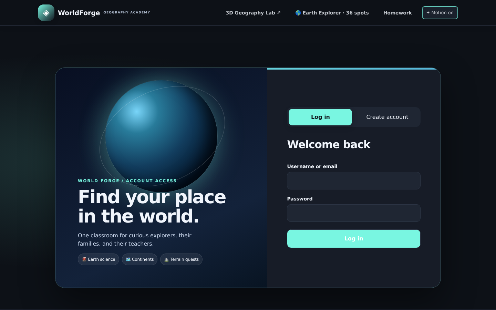
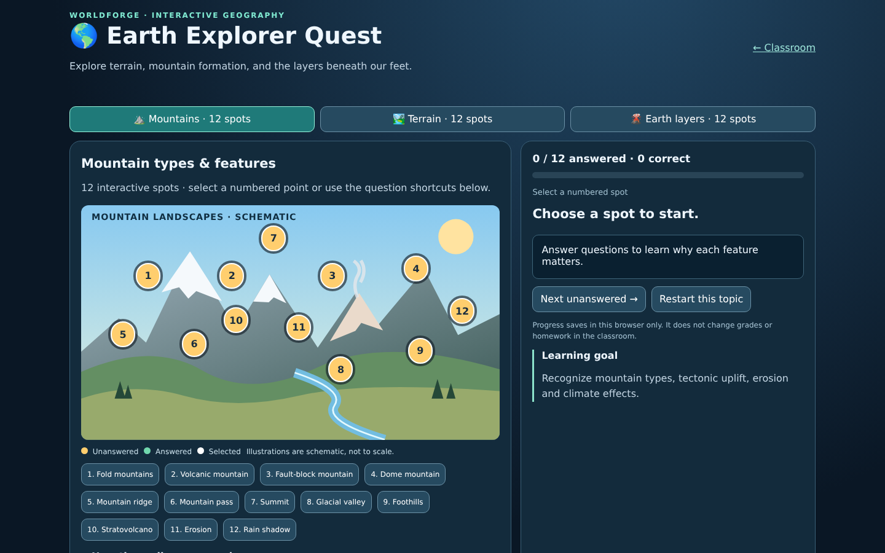
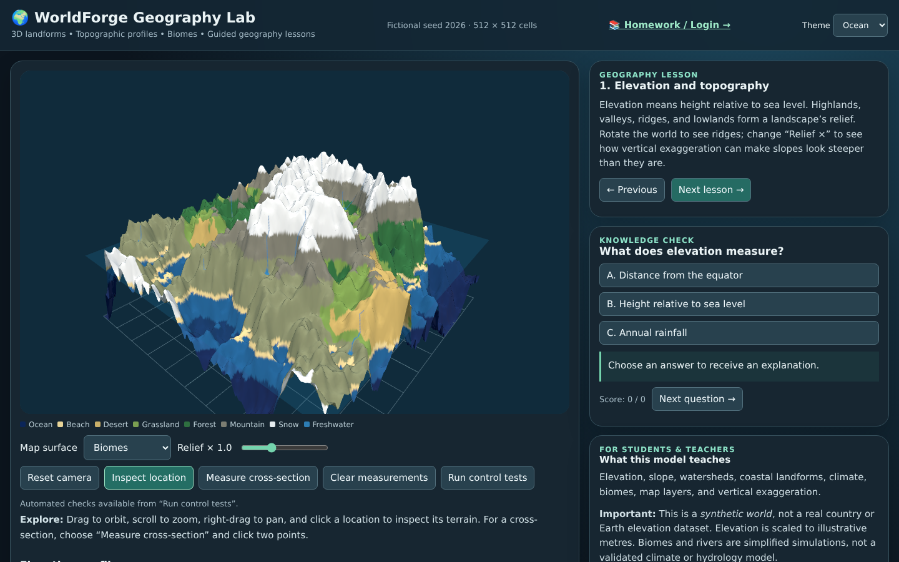

<div align="center">

# 🌍 WorldForge Geography Academy

**Interactive 3D geography · Earth science · Family learning · Homework**

[](https://github.com/iamrichmack111/worldforge-geography-academy/actions/workflows/ci-cd.yml)


[**Quick Start**](#-quick-start) • [**Gallery**](#-screenshots) • [**Container**](#-docker) • [**Documentation**](docs/wiki/Home.md) • [**Demo Releases**](https://github.com/iamrichmack111/worldforge-geography-academy/releases)

</div>

## About the project

WorldForge is a **self-hosted geography and Earth science learning prototype** for homeschool students, parents and teachers. It combines interactive geography activities with parent-managed assignments, grading and progress tracking.

### Learning experiences

| Area | What you can do |
|---|---|
| 3D terrain | Explore simulated elevation, climate, coastlines and caves |
| Landform quest | Click learning spots for mountains, canyons, valleys and plateaus |
| Earth science | Learn about the crust, mantle, core and Earth's physical processes |
| Continents | Study seven continents and physical geography |
| Homework | Assign, submit, review and grade work |
| Daily challenges | Complete increasingly long geography exercises |
| Family accounts | Student, parent and teacher roles with account linking |
| Study tools | Quizzes, worksheets, flashcards, facts and themes |

> **Geography note:** The generated 3D world is **fictional**, not actual satellite or elevation data. The app is for a trusted local network, not an internet-facing service for children's records.

## 📸 Screenshots

### Redesigned login



### Clickable mountain and terrain lessons



### 3D terrain explorer



## 🚀 Quick start

```bash
python3 -m pip install -r requirements.txt
PORT=8032 python3 server.py
```

Open **http://localhost:8032/classroom.html**. On the family LAN, use **http://family.local:8032/classroom.html**.

## 🐳 Docker

```bash
PORT=8032 docker compose up --build -d
docker compose ps
```

Persistent student records live in the Docker volume. Keep that database private and out of Git.

After **successful** GitHub Actions completion, the published image will be at:

`ghcr.io/iamrichmack111/worldforge-geography-academy:latest`

> A Dockerfile in the repository is not proof the registry image has been published; check [Actions](https://github.com/iamrichmack111/worldforge-geography-academy/actions) and [Packages](https://github.com/iamrichmack111?tab=packages).

## 🧪 Tests and CI/CD

```bash
python3 -m pip install -r requirements.txt pytest playwright
python3 -m unittest discover -s tests -p 'test_*.py' -v
```

GitHub Actions runs Python tests, JavaScript syntax checks and a Docker build. On `main`, passing builds are pushed to GitHub Container Registry (GHCR). See [.github/workflows/ci-cd.yml](.github/workflows/ci-cd.yml).

Playwright screenshots are under `media/screenshots/`; browser E2E tests are in `tests/test_controls.py` and require a Chromium installation.

## 🎬 Narrated walkthrough

[Browse demo releases](https://github.com/iamrichmack111/worldforge-geography-academy/releases). Source tooling is in `scripts/`.

## 📚 Documentation

[Installation](docs/wiki/Installation.md) · [Family accounts](docs/wiki/Family-Accounts.md) · [Architecture](docs/wiki/Architecture.md) · [Study guide](docs/wiki/Study-Guide.md)

## License

No open-source license has been selected yet. All rights reserved unless a license is explicitly added.
